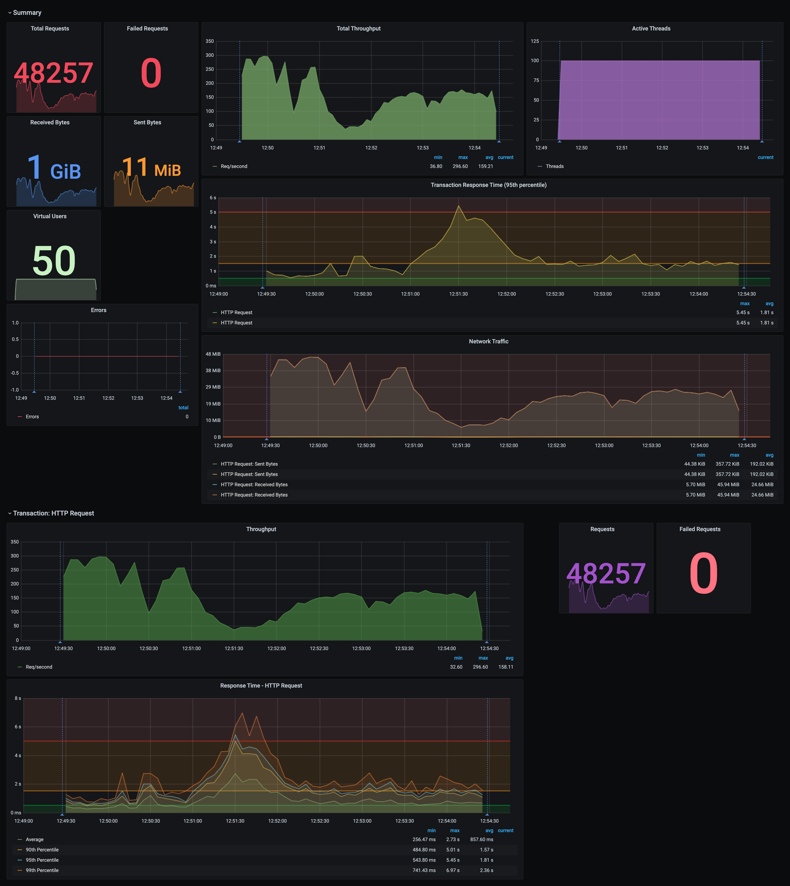

# JMeter Grafana Dashboard

Grafana Dashboard with InfluxDB for JMeter Performance Results

[:construction: Work In Progress]



## How To

Follow the given instructions to configure both JMeter and Grafana dashboards in your local environment.

### Docker Grafana & InfluxDB

Execute the following `docker-compose` command from `Docker` directory to spin and run a set of containers with `Grafana` and `InfluxDB` as configured

```sh
# `-d` flag to detach the process and to run it in background
docker-compose up [-d]
```

Execute the following command to tail the logs of the containers if the `docker-compose` is executed with detach mode

```sh
docker-compose logs -f
```

Once the containers are started successfully, navigate to [`http://localhost:3000`](http://localhost:3000) to access the Grafana Dashboard. Enter the following credentials to log-in to the Grafana Dashboard

- Username: `admin`
- Password: `admin`

#### Import Dashboards

- Hover on the `+` symbol and select `Import` to import an existing Dashboard to the Grafana.
- Select the `Upload JSON File` option in the following screen and upload the [`grafana-jmeter-dashboard.json`](Grafana%20Dashboard/grafana-jmeter-dashboard.json) and import

> Note: The Grafana is configured with InfluxDB datasource as default. Please follow the [`JMeter InfluxDB Configurations`](#jmeter-influxdb-configuration) to configure an InfluxDB instance for the JMeter performance results.

### JMeter InfluxDB Configuration

Once the Docker services are up and running, execute the following cURL command to create a database named `jmeter_influx` to store the performance metrics.

```sh
curl --location --request POST 'http://localhost:8086/query' \
    --header 'Content-Type: application/x-www-form-urlencoded' \
    --data-urlencode 'q=CREATE DATABASE jmeter_influx'
```

#### Configure Grafana with JMeter InfluxDB

Once the `jmeter_influx` DB is created successfully, sign-in to the Grafana Dashboard and perform the following to configure the `jmeter_influx` DB in the Grafana environment.

1. Hover the `cogwheel` icon and go to `Datasources`
2. `Add data source` > select `InfluxDB` and enter the following
   1. Name: `JMeter InfluxDB`
   2. URL: `http://infuxdb:8086`
   3. Database: `jmeter_influx`
   4. User: `admin`
   5. Password: `admin`
3. Click on `Save & Test`

### JMeter

Next, configure the JMeter to send the performance metrices to the InfluxDB while performing a load test in your environment. This repo contains a simple sample JMeter script [attached](JMeter%20Script/grafana-mock-test.jmx).

Perform the following to configure InfluxDB Backend Listener in JMeter

1. Add a Backend Listener to the JMeter script
2. Select the `Backend Listener Implementation` as `org.apache.jmeter.visualizers.backend.influxdb.InfluxdbBackendListenerClient`
3. Fill the following information
   1. `influxdbMetricsSender`: `org.apache.jmeter.visualizers.backend.influxdb.HttpMetricsSender`
   2. `influxdbUrl`: `http://localhost:8086/write?db=jmeter_influx`
   3. `application`: Provide an application name (ex: `Mock Application`)
   4. `measurement`: `jmeter`
   5. `summaryOnly`: Boolean value (ex. `true` or `false`)
   6. `samplersRegex`: `.*`
   7. `percentiles`: `90;95;99`
   8. `testTitle`: `Grafana Mock Test Plan`
4. And save the script and perform a load testing

Once the load test is executed, navigate to the Grafana Dashboard and open our `JMeter Dashboard`. Select the ...

- `JMeter-InfluxDB` as the `Datasource`
- The Application name
- The Transaction

to view the performance metrices in realtime.

## References

The Grafana Dashboard presented in this repo is an extended version of [13417](https://grafana.com/grafana/dashboards/13417) including the default JMeter Dashboard metrics.

- [mderevyankoaqa/jmeter-influxdb-listener-plugin](https://github.com/mderevyankoaqa/jmeter-influxdb-listener-plugin)
- [ufctester/apache-jmeter](https://github.com/ufctester/apache-jmeter)
